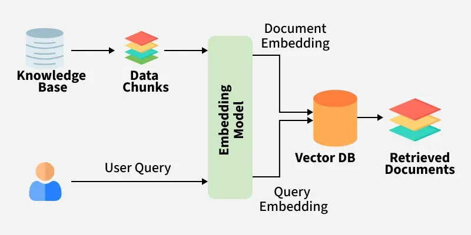

# RAG System using Local Models (Ollama + FAISS)



## Overview

This project implements a Retrieval-Augmented Generation (RAG) system using a local language model. The system processes a PDF document, converts it into embeddings, stores them in a FAISS index, and retrieves relevant information to answer user queries.

The entire pipeline runs locally without relying on external APIs.

---

## Project Structure

```text
Task-3/
│
├── data/
│   └── Trip.pdf
│
├── embeddings/
│   ├── embedding.py
│   └── model.py
│
├── llm/
│   ├── model.py
│   └── query.py
│
├── preprocessing/
│   ├── chunker.py
│   └── pdf_to_text_extractor.py
│
├── main.py
├── output.txt
├── rag_chunks.json
├── rag_index.faiss
├── pyproject.toml
├── uv.lock
└── README.md
```

---

## System Workflow

The system follows this pipeline:

1. Extract text from PDF
2. Split text into chunks
3. Convert chunks into embeddings
4. Store embeddings in FAISS index
5. Convert user query into embedding
6. Retrieve relevant chunks
7. Send context to local model (Ollama - Phi-3)
8. Generate answer

---

## Module Explanation

### preprocessing/

#### pdf_to_text_extractor.py

Extracts text from the PDF using PyMuPDF.

#### chunker.py

Splits extracted text into smaller chunks using recursive splitting.

---

### embeddings/

#### model.py

Loads the embedding model (`all-MiniLM-L6-v2`).

#### embedding.py

* Converts chunks into embeddings
* Stores embeddings in FAISS
* Saves chunk mapping in `rag_chunks.json`

---

### llm/

#### model.py

Handles connection with the local model (Phi-3 via Ollama).

#### query.py

* Takes user query
* Retrieves top matching chunks
* Sends context + query to the model
* Returns generated response

---

### main.py

Entry point of the application.
Coordinates the full RAG pipeline from query to answer.

---

## How It Works

### 1. Text Extraction

PDF content is extracted and converted into raw text.

### 2. Chunking

Text is split into manageable chunks using a recursive strategy:

* Maintains semantic meaning
* Ensures optimal size for embedding

### 3. Embedding

Each chunk is converted into a vector representation using Sentence Transformers.

### 4. FAISS Indexing

Embeddings are stored in a FAISS index for fast similarity search.

### 5. Query Processing

User query is converted into an embedding and compared with stored vectors.

### 6. Retrieval

Top matching chunks are retrieved using FAISS indices.

### 7. Answer Generation

Retrieved chunks are passed as context to the Phi-3 model via Ollama.

---

## Running the Project

### 1. Setup environment

```bash
uv venv
source .venv/bin/activate
```

### 2. Install dependencies

```bash
uv pip install sentence-transformers faiss-cpu pymupdf requests langchain
```

### 3. Run preprocessing

```bash
python preprocessing/pdf_to_text_extractor.py
```

### 4. Create embeddings and index

```bash
python embeddings/embedding.py
```

### 5. Run the application

```bash
python main.py
```

---

## Key Concepts

### Embeddings

Text is converted into numerical vectors that represent semantic meaning.

### FAISS

Used to perform fast similarity search between vectors.

### Retrieval

FAISS returns indices of similar vectors, which are mapped back to original text.

### Generation

The local model generates answers using retrieved context.

---

## Important Notes

* FAISS index does not store original text; chunks are stored separately.
* The system uses a local model (Phi-3) via Ollama.
* Chunk size and overlap are tuned for better retrieval.

---

## Limitations

* Performance depends on chunk quality
* Smaller models like Phi-3 may struggle with complex reasoning
* No reranking implemented

---

## Conclusion

This project demonstrates a complete RAG pipeline using local tools. It combines document processing, vector search, and language models to generate context-aware answers efficiently.
