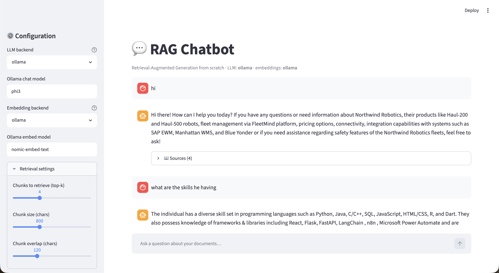

# RAG Chatbot from Scratch (Ollama / Azure OpenAI / Claude)



A conversational Retrieval-Augmented Generation (RAG) chatbot built without LangChain or LlamaIndex. Every piece of the pipeline — document loading, chunking, embeddings, the vector store, retrieval and the chat loop — is hand-written.

The LLM backend is switchable between Ollama (local), Azure OpenAI and Anthropic Claude through a single configuration setting. The working demo runs fully local on Ollama and a Streamlit web UI provides the chat interface.

> Assignment 4 — Create a Chatbot with RAG (Lesson 1).

---

## Overview

This project implements a full RAG pipeline from scratch. A small knowledge base of documents is loaded from `data/`, split into overlapping chunks, converted into embedding vectors, and stored in a NumPy-backed vector store. When the user asks a question through the Streamlit UI, the question is embedded, the most similar chunks are retrieved by cosine similarity, and those chunks are passed as context to the LLM along with the running conversation history. The model's answer is streamed back into the chat, and the retrieved source chunks are displayed alongside it.

The same code can talk to three different model providers — Ollama, Azure OpenAI, or Claude — by changing one environment variable. This is the "switching endpoints" idea applied in practice.

---

## Project Structure

```text
Task-4/
├── app.py                  # Streamlit chat UI (entry point)
├── ingest.py               # CLI helper to build / rebuild the index
│
├── rag/                    # the from-scratch RAG toolkit
│   ├── config.py           # Settings loaded from .env (backends, models, params)
│   ├── loaders.py          # reads .txt / .md / .pdf  (PyMuPDF for PDFs)
│   ├── chunker.py          # hand-written recursive/greedy text splitter
│   ├── embeddings.py       # text -> vectors  (Ollama or Azure)
│   ├── vector_store.py     # NumPy cosine-similarity store + persistence
│   ├── retriever.py        # embed query -> top-k chunks
│   ├── llm.py              # switchable streaming chat: Ollama / Azure / Claude
│   └── pipeline.py         # build_index + RAGChatbot orchestration
│
├── data/                   # knowledge base (sample fictional company docs)
│   ├── northwind_handbook.md
│   └── northwind_products.md
├── index/                  # generated vectors (git-ignored, auto-built)
│
├── .env / .env.example     # configuration
├── .streamlit/config.toml  # UI theme
└── pyproject.toml
```

---

## Module Explanation

### rag/loaders.py
Reads raw documents from the `data/` folder. Supports plain text, Markdown and PDF. PDFs are extracted page by page using PyMuPDF; text and Markdown are read directly. Each file becomes a `{"source": filename, "text": content}` record.

### rag/chunker.py
A hand-written text splitter, written without any framework. It normalises whitespace, breaks the text into "units" at paragraph and sentence boundaries, then greedily packs those units into chunks of roughly `chunk_size` characters. A small `overlap` tail from one chunk is carried into the next so context is not lost at the seams. Any single unit larger than a whole chunk is hard-split as a fallback.

### rag/embeddings.py
Converts a list of strings into embedding vectors. Two backends are supported:
- `ollama` calls the local Ollama HTTP API (`nomic-embed-text` by default).
- `azure` calls an Azure OpenAI embeddings deployment (`text-embedding-3-small` by default).

Both return a NumPy array of shape `(N, dim)`.

### rag/vector_store.py
A small vector store backed entirely by NumPy. Embeddings are L2-normalised on insertion, so a cosine-similarity search is a single matrix-vector dot product. It supports `add`, `search(top_k)`, and persistence to disk as `embeddings.npy` plus `chunks.json`. Brute-force search is intentional — for small to medium knowledge bases it is instant and keeps the retrieval step transparent.

### rag/retriever.py
Embeds the user's query through the configured backend and returns the top-k most similar chunks. Also provides `format_context` to render the retrieved chunks into a numbered, source-tagged block for the prompt.

### rag/llm.py
The generation step. Exposes a single `stream_chat(messages, settings)` function that yields tokens, with three internal implementations:
- `ollama` streams from `POST /api/chat`.
- `azure` streams from an Azure OpenAI chat deployment via the official `openai` SDK.
- `claude` streams from Anthropic's Messages API. The Anthropic SDK keeps the system prompt separate, so it is extracted automatically.

The rest of the app only calls `stream_chat`; it never has to know which provider is behind it.

### rag/pipeline.py
Glues everything together. `build_index` loads documents, chunks them, embeds them, and saves the vector store. `load_or_build_index` reuses the cached index when present. `RAGChatbot.answer(query, history)` retrieves context for the latest question, builds a prompt out of the system instructions, prior turns and the new question + context, and streams the model's reply.

### rag/config.py
A `Settings` dataclass loaded from `.env`. Holds the backend choices, model names, RAG parameters (`chunk_size`, `chunk_overlap`, `top_k`) and paths. Passing this object through the pipeline lets the Streamlit sidebar override any setting for a single session without touching the file.

### app.py
The Streamlit chat UI. Renders a sidebar where the user can switch LLM/embedding backends, change model names, tune `top-k` and chunk parameters, upload documents, and rebuild the index. The main area is a chat with streamed responses; each assistant reply has a "Sources" expander that shows which chunks were retrieved and their similarity scores.

### ingest.py
A small command-line helper that builds the index from `data/`. The Streamlit app also builds the index on first run, so this is optional.

### data/
Two Markdown documents about a fictional company, Northwind Robotics — an employee handbook and a product/support FAQ. They give the demo concrete facts to retrieve and clear "not in the knowledge base" cases.

---

## How It Works

```
 documents (data/)
      |  loaders.py            read .txt / .md / .pdf
      v
   chunking                    chunker.py  (recursive/greedy, with overlap)
      |
      v
  embeddings                   embeddings.py  (Ollama nomic-embed-text / Azure)
      |
      v
 vector store                  vector_store.py  (NumPy, L2-normalised, cosine)
      |
======+===============  index built and cached to index/  =================
      |
 user question ---> embed query ---> top-k cosine search ---> context
      |                                                          |
      +------------> prompt = system + history + context + question
                                          |
                                          v
                                   LLM (llm.py)  ---> streamed answer + sources
```

1. Load every document in `data/`.
2. Chunk each into ~800-character overlapping pieces using the custom splitter.
3. Embed the chunks and store the unit-normalised vectors in NumPy.
4. On each question, embed the query and find the top-k chunks by cosine similarity.
5. Build a prompt from the system instructions, the conversation history and the retrieved context, and stream the model's answer back into the UI.

---

## Backends — Switching Endpoints

Two environment variables (or the sidebar) decide which provider does what:

| Variable        | Options                  | Purpose                          |
| --------------- | ------------------------ | -------------------------------- |
| `LLM_BACKEND`   | `ollama` `azure` `claude`| who generates the answer         |
| `EMBED_BACKEND` | `ollama` `azure`         | who turns text into vectors      |

| Backend       | Chat model (default) | Embeddings                              | Needs                       |
| ------------- | -------------------- | --------------------------------------- | --------------------------- |
| Ollama        | `phi3`               | `nomic-embed-text`                      | Ollama running locally      |
| Azure OpenAI  | `gpt-4o` deployment  | `text-embedding-3-small` deployment     | endpoint + key              |
| Claude        | `claude-sonnet-4-5`  | use Ollama or Azure (Anthropic has no embeddings API) | `ANTHROPIC_API_KEY` |

Note on the provided Azure endpoint: the original assignment endpoint (`paletteai.openai.azure.com`) no longer resolves — the Azure resource has expired — so the working demo runs on Ollama. To use Azure instead, set a live endpoint and key in `.env` and switch `LLM_BACKEND=azure` and `EMBED_BACKEND=azure`.

---

## Setup and Run

### 1. Prerequisites

- [uv](https://docs.astral.sh/uv/) and Python 3.13
- [Ollama](https://ollama.com) running locally, with the models pulled:

```bash
ollama pull phi3              # chat model
ollama pull nomic-embed-text  # embedding model
```

### 2. Install dependencies

```bash
uv sync
```

### 3. Configure

```bash
cp .env.example .env          # defaults already target local Ollama
```

### 4. Build the index (optional — the app also builds it on first run)

```bash
uv run python ingest.py
```

### 5. Launch the chatbot

```bash
uv run streamlit run app.py
```

Open the URL Streamlit prints (default http://localhost:8501).

---

## Try These Questions

The sample knowledge base is a fictional company, Northwind Robotics:

- "How many vacation days do full-time employees get, and what's the 401k match?"
- "What is the payload and price of the Haul-500?" — then a follow-up: "And the smaller one?"
- "What's the maintenance interval for the robots?"
- "What is Northwind's stock ticker?" — the bot correctly says it does not have that information in the knowledge base.

Use the sidebar to switch backends, change the model, tune `top-k` or chunk size, upload your own documents, and rebuild the index.

---

## Key Concepts

### Chunking
Long documents are split into smaller overlapping pieces so each piece fits comfortably into the model's context and so the embedding represents a focused topic. The overlap preserves continuity across chunk boundaries.

### Embeddings
Each chunk is turned into a high-dimensional numerical vector that captures its semantic meaning. Texts with similar meaning end up close to each other in vector space.

### Vector Store and Cosine Similarity
The embeddings are stored as a NumPy matrix. After L2-normalising the vectors, cosine similarity reduces to a dot product, so retrieval is a single matrix-vector multiplication — no FAISS or external database is needed.

### Retrieval
The user's question is embedded with the same model, compared against every stored vector, and the top-k most similar chunks are returned along with their similarity scores.

### Generation
The retrieved chunks are inserted into the prompt as labelled context. The system prompt instructs the model to answer only from that context and to admit when an answer is not present, which keeps the chatbot grounded.

### Conversational Memory
The Streamlit app keeps the full message history in session state. Each turn re-runs retrieval on the latest question but passes the prior turns to the model, so follow-ups like "and the smaller one?" work.

---

## Notes and Limitations

- Brute-force NumPy search is intentional. It is clear and instant for small to medium knowledge bases. For very large corpora, swap in an approximate nearest-neighbour index such as FAISS.
- Changing the embedding backend or embedding model requires rebuilding the index, since vectors from different models are not comparable. The sidebar's "Rebuild index" button handles this.
- Retrieval uses the raw latest question. A query-rewriting step that incorporates conversation history could make multi-turn retrieval even sharper.
- `.env` is git-ignored so secrets are never committed; `.env.example` is the shareable template.

---

## Conclusion

This project demonstrates a complete, end-to-end RAG chatbot built from first principles. It combines document loading, a custom chunker, embedding generation, NumPy-based vector search, conversational history and a switchable LLM layer, all served through a Streamlit chat UI. The same architecture runs locally on Ollama for free and offline, or against Azure OpenAI or Claude with a single setting change.
